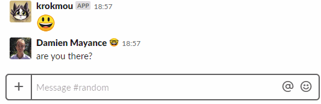

# <center></center>

> `botmou` is a pre-configured [Hubot](https://hubot.github.com) installation that can be connected to a Google Sheet and/or a Cleverbot instance.

Fork this repository if you want to make some changes or add new scripts. Or you could just clone and deploy it on your server or VPS instance.

## Installation

Clone this repository (or your fork):

```shell
git clone REPO_URL
cd REPO

# Install packages:
yarn

# Start the bot:
yarn start
```

Then, in the hubot shell:

```shell
# Type:
botmou> botmou ping

# And… 🎉
botmou> Shell: pong
```

You're ready.

## Configuration

### Slack integration

You should add the [Hubot app](https://slack.com/apps/A0F7XDU93-hubot) in your Slack configuration. It will generate a token.

Configure the `HUBOT_SLACK_TOKEN` environment variable to bind this bot to your Slack team with the newly generated token.

Don't forget to set a custom name here for your bot.

### Using a Google Sheet

First, we need to create a public Google Sheet.

1. [Create a copy of this Google Sheet model](https://docs.google.com/spreadsheets/d/1zBVFMGqO3jfBwEfVtEdfb9jtIWp7q036EH8G0g84HLE/).
2. Turn on web publishing by going to "File/Publish to web".
3. Copy the Google Sheet link with the big "Share" button on the top right of your sheet.

[(You can find more information about this here.)](https://github.com/theoephraim/node-google-spreadsheet#unauthenticated-access-read-only-access-on-public-docs)

You have a token inside this link:

```shell
# Example:
https://docs.google.com/spreadsheets/d/thisismytoken/

# The token is: thisismytoken
```

Add this token as an environment variable when launching the bot.

For example, if you want to try the model in your shell, type:

```shell
# On macOS or Linux.
env SHEET_TOKEN=1zBVFMGqO3jfBwEfVtEdfb9jtIWp7q036EH8G0g84HLE yarn start
```

**Note: be careful, the sheet is potentially visible by anyone.**

### Cleverbot

You can also use Cleverbot with your bot. You need to get a token on [cleverbot.com](https://www.cleverbot.com/api/my-account/).

Try it with:

```shell
env CLEVERBOT_TOKEN=token yarn start

# In your Hubot shell, type:
botmou: hello my dear bot!

# If it's working, you should get a pseudo-intelligent answer.
```

### Bot name

The actual name will be configured in the Slack App configuration.

However, if you want to customize the name in your shell, open your `package.json` file and change `botmou` by anything you want:

```json
"scripts": {
  "start": "hubot --name \"botmou\"",
  "prod": "hubot --name \"botmou\" --adapter slack",
},
```

## Deployment

It's up to you!

But in the end, you should have at least 2 of these 3 variables configured:

- `HUBOT_SLACK_TOKEN` (mandatory)
- `SHEET_TOKEN` (optional)
- `CLEVERBOT_TOKEN` (optional)

Otherwise, this bot will be pretty useless.

### Docker container

There's a Dockerfile provided with this repository.

Don't forget to set an env-file when starting the container:

```shell
docker build -t botmou .
docker run --name botmou --restart always --env-file /path/to/botmou.env -d botmou
```

Env-file boilerplate:

```
HUBOT_SLACK_TOKEN=
CLEVERBOT_TOKEN=
SHEET_TOKEN=
```

## Contributing

Feel free to send a pull request. 🙏

Your code must pass the [ESLint](https://eslint.org/) check and be formatted through [Prettier](https://prettier.io/). Hopefully, this is automagically executed before any commit, so you shouldn't have to worry too much about this.

Also do note that this is a **boilerplate repository**. It means that a change must be useful to everyone to be accepted. A private joke for you Slack team is for your fork, not this base repository. 😉

(For example, we have multiple custom scripts for our own [Pixelnest's botmou, called "Krokmou"](https://pixelnest.io/), like an angry mode, a reaction mode and other special ones — yet, those are purely private jokes and behaviors, so we don't publish them on this repository.)
